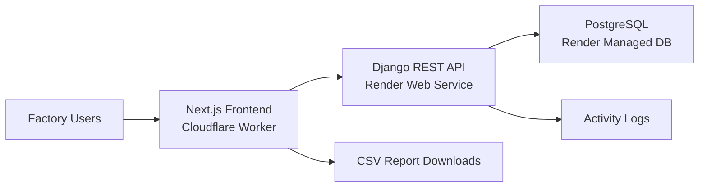

# Digital Factory Management System
## End-to-End Client Project Report

**Project**: Digital Factory Management System  
**Prepared For**: Client Handover / Stakeholder Review  
**Prepared On**: April 12, 2026  
**Prepared By**: Engineering Team

---

## 1. Executive Summary

The Digital Factory Management System is a full-stack web platform built to digitize and centralize key factory operations for garment manufacturing.  
It provides role-based access, real-time operational visibility, production tracking, inventory control, quality management, worker productivity analysis, planning workflows, and downloadable management reports.

The product is designed to reduce manual tracking, improve production predictability, support data-driven decisions, and increase operational transparency across departments.

---

## 2. Business Objectives

The solution addresses these core business needs:

1. Centralized control of production operations.
2. Real-time visibility of order progress, quality outcomes, and material status.
3. Role-based accountability across admin, planners, supervisors, inspectors, store managers, and viewers.
4. Faster decision-making through dashboards and report exports.
5. Reduced operational errors through validations and standardized workflows.

---

## 3. Solution Scope

### 3.1 In Scope (Implemented)

1. Authentication and JWT session management.
2. Role-based access control (RBAC).
3. Master data management:
   - Users
   - Buyers
   - Production lines
   - Materials
   - Workers
   - Defect types
4. Order lifecycle management.
5. Production entry logging.
6. Inventory inward, issue, adjustment, and stock analytics.
7. Worker productivity tracking and summaries.
8. Quality inspection workflows and defect trend analysis.
9. Production planning, planning calendar, planned-vs-actual analysis.
10. Dashboard KPIs and recent activity summaries.
11. Multi-domain reports with CSV export support.

### 3.2 Out of Scope (Current Phase)

1. Mobile-native app delivery.
2. ERP/Accounting integrations.
3. IoT machine telemetry integrations.
4. Multi-tenant organization partitioning.
5. Advanced forecasting/ML modules.

---

## 4. User Roles and Access Model

Implemented user roles:

1. `admin`
2. `store_manager`
3. `production_supervisor`
4. `quality_inspector`
5. `planner`
6. `supervisor` (legacy compatible role)
7. `viewer`

### Access Principle

- Access is controlled on both backend API permissions and frontend navigation visibility.
- Sensitive administrative actions (for example user lifecycle actions) are restricted to admin-level access.
- Read-only or limited workflows are available to viewer-type users as configured.

---

## 5. Technology Stack

### 5.1 Frontend

1. Next.js 16 (App Router, TypeScript)
2. React 19
3. Tailwind CSS
4. React Query
5. React Hook Form + Zod
6. Recharts
7. OpenNext for Cloudflare deployment

### 5.2 Backend

1. Django 5
2. Django REST Framework
3. django-filter
4. SimpleJWT (access + refresh token model)
5. WhiteNoise (static serving strategy for production service model)
6. Gunicorn (WSGI process server)

### 5.3 Database

1. PostgreSQL (production)
2. SQLite (possible local development option)

---

## 6. Architecture Overview

### Key Characteristics

1. Stateless API layer with JWT authentication.
2. Clean separation of frontend UI and backend service.
3. Environment-driven configuration for host/origin/security controls.
4. Deployable to cloud environments with managed DB and CDN edge delivery.

---

## 7. Functional Module Breakdown

### 7.1 Authentication & Session

1. Login with username/password.
2. JWT access token + refresh token lifecycle.
3. Current-user profile endpoint for session restoration.
4. Auto-refresh behavior in API client.

### 7.2 User Management

1. Create, update, list, and deactivate/delete users.
2. Role assignment.
3. Guardrails such as preventing self-delete.
4. Activity logging for key lifecycle events.

### 7.3 Buyer Management

1. Buyer master records.
2. Contact, company, and notes capture.
3. Integration with order creation.

### 7.4 Production Lines

1. Line setup and status management.
2. Used by production, planning, inventory issue, and productivity flows.

### 7.5 Order Management

1. Order creation with buyer linkage, stage, priority, and delivery date.
2. Auto-generated order code format.
3. Status logic derived from production activity and delivery context.
4. Order-level production summaries.

### 7.6 Production Entries

1. Daily output entry by line, order, and supervisor.
2. Validation: rejected quantity cannot exceed produced quantity.
3. Efficiency calculation support.

### 7.7 Inventory Management

1. Material master (type, unit, barcode optional).
2. Material inward transactions.
3. Material issue transactions (line/order-linked).
4. Stock adjustments (increase/decrease).
5. Stock summary, stock movement, low-stock, and consumption-variance analytics.

### 7.8 Workforce & Productivity

1. Worker master with line assignment and skills.
2. Worker productivity entries by date/order/line.
3. Efficiency and rework-aware metrics.
4. Worker, line, and overall productivity summary endpoints.

### 7.9 Quality Management

1. Defect type master with severity levels.
2. Quality inspections by stage (inline/endline/final).
3. Defect capture at inspection level.
4. Defect/rejection trends and summary analytics.
5. Validation checks on inspected vs passed/defective/rejected values.

### 7.10 Planning

1. Production plan creation by order and line.
2. Planning calendar view endpoints.
3. Planned-vs-actual analytics.
4. Business validation for:
   - Date range validity
   - Line plan overlap prevention
   - Planned quantity not exceeding remaining order quantity

### 7.11 Dashboard & Reporting

1. KPI summary endpoints.
2. Line performance data.
3. Recent activity stream.
4. Domain reports:
   - Production
   - Orders
   - Inventory
   - Consumption
   - Productivity
   - Quality
   - Planning
5. CSV export endpoints for each report domain.

---

## 8. Frontend Feature Coverage (Page-Level)

Implemented major pages include:

1. Authentication:
   - `/login`
2. Dashboard:
   - `/dashboard`
3. Core Operations:
   - `/buyers`, `/buyers/[id]`
   - `/lines`
   - `/orders`, `/orders/[id]`
   - `/production-entries`
4. Inventory:
   - `/materials`, `/materials/[id]`
   - `/material-inward`
   - `/material-issues`
   - `/stock-adjustments`
   - `/inventory/stock-summary`
   - `/inventory/consumption-variance`
5. Workforce:
   - `/workers`, `/workers/[id]`
   - `/worker-productivity`
   - `/worker-productivity/summary`
6. Quality:
   - `/defect-types`
   - `/quality-inspections`, `/quality-inspections/[id]`
   - `/quality/summary`
7. Planning:
   - `/production-plans`
   - `/production-plans/calendar`
   - `/production-plans/planned-vs-actual`
8. Reports:
   - `/reports/production`
   - `/reports/orders`
   - `/reports/inventory`
   - `/reports/consumption`
   - `/reports/productivity`
   - `/reports/quality`
   - `/reports/planning`
9. Administration:
   - `/users`
   - `/profile`

---

## 9. Backend API Coverage (High-Level)

Base API path: `/api/v1/`

### Core Endpoint Groups

1. Health:
   - `GET /health/`
2. Authentication:
   - `POST /auth/login/`
   - `POST /auth/refresh/`
   - `GET /auth/me/`
3. CRUD Resource Sets:
   - `/users/`
   - `/buyers/`
   - `/lines/`
   - `/orders/`
   - `/production-entries/`
   - `/materials/`
   - `/material-inward/`
   - `/material-issues/`
   - `/stock-adjustments/`
   - `/workers/`
   - `/worker-productivity/`
   - `/defect-types/`
   - `/quality-inspections/`
   - `/production-plans/`
4. Analytics + Reporting:
   - Dashboard summary, line performance, recent activities
   - Inventory analytics endpoints
   - Productivity summaries
   - Quality trends/summaries
   - Planning calendar/planned-vs-actual
   - Reports and CSV exports

---

## 10. Data Model Summary

Key data entities and relations:

1. `User` -> role-based actor model.
2. `Buyer` -> order customer master.
3. `Order` -> central production demand object.
4. `ProductionLine` -> capacity/work-center unit.
5. `ProductionEntry` -> execution records against orders/lines.
6. `Material`, `MaterialStockInward`, `MaterialStockIssue`, `StockAdjustment` -> inventory ledger model.
7. `Worker`, `WorkerProductivityEntry` -> workforce and performance data.
8. `DefectType`, `QualityInspection`, `QualityInspectionDefect` -> quality model.
9. `ProductionPlan` -> planned capacity allocation.
10. `ActivityLog` -> auditable activity trail.

Validation constraints are implemented at model level to preserve data quality.

---

## 11. Security and Governance

### 11.1 Authentication & Authorization

1. JWT-based auth (`Bearer` token).
2. DRF default permission set to authenticated access.
3. Role-specific permission classes for protected modules.

### 11.2 Web/API Security Controls

1. Configurable `ALLOWED_HOSTS`.
2. CORS allow-list based policy (`CORS_ALLOWED_ORIGINS`).
3. CSRF trusted origin configuration for browser-based flows.
4. Secure-cookie and HSTS controls available for production mode.
5. Proxy SSL header support for cloud reverse-proxy deployment.

---

## 12. Deployment and Production Topology

### 12.1 Recommended/Configured Production Pattern

1. Frontend: Cloudflare Worker deployment (`vaeyu-erp`) with route:
   - `erp.vaeyuinnovations.com/*`
2. Backend: Render web service (`digital-factory-backend`).
3. Database: Render managed PostgreSQL (`digital-factory-postgres`).

### 12.2 Runtime Configuration Highlights

1. Backend auto-deploy enabled (`render.yaml`).
2. Health endpoint path configured for uptime checks (`/api/v1/health/`).
3. CORS/CSRF trusted origins configured for production frontend domains.
4. `BACKEND_PUBLIC_URL` configured for public API endpoint use.

---

## 13. Operations and Release Process

Typical release workflow:

1. Implement feature/fix.
2. Run local checks (`typecheck`, backend checks, smoke tests).
3. Commit and push to repository main branch.
4. Backend auto-deploy (Render) triggers from repository updates.
5. Frontend deploy via OpenNext + Wrangler (`npm run deploy`).
6. Validate production URLs and critical flows (login, dashboard, report export).

---

## 14. QA and Validation Checklist

Before client sign-off, validate:

1. Login/logout and token refresh behavior.
2. Role-based menu visibility and access restrictions.
3. CRUD for buyers, lines, orders, materials, workers, defect types.
4. Production entry and quality inspection validations.
5. Inventory stock calculations and variance outputs.
6. Planning overlap and quantity constraints.
7. Dashboard KPI values and chart rendering.
8. Report filtering and CSV exports.
9. Production domain CORS configuration for frontend origin.
10. Health endpoint and uptime checks.

---

## 15. Known Risks and Recommendations

1. Ensure all production credentials are rotated and managed in platform secrets (not in repository files).
2. Add scheduled backup verification and restore drill for database continuity.
3. Add API integration tests and end-to-end browser tests for regression prevention.
4. Introduce audit dashboards and alerting for key operational failures.
5. Plan phased integration with barcode scanners and procurement/accounting systems where required.

---

## 16. Handover Assets

The following are included in this repository:

1. Root project setup guide (`README.md`).
2. Backend operational guide (`backend/README.md`).
3. Frontend operational guide (`frontend/README.md`).
4. Infrastructure-as-code style deployment baseline (`render.yaml`).
5. Seed-data command for demo and onboarding environments.

---

## 17. Client Sign-Off Template

**Client Representative**: ____________________  
**Date**: ____________________  
**Environment Validated**: ____________________  
**Accepted Scope**: ____________________  
**Comments / Open Items**: ____________________

---

## Appendix A: Suggested Next-Phase Enhancements

1. Advanced production forecasting and bottleneck prediction.
2. Raw material auto-reorder threshold workflows.
3. Multi-factory support with tenant-level segmentation.
4. SLA dashboards for delivery and rejection trend monitoring.
5. Barcode scanner mobile companion app.

