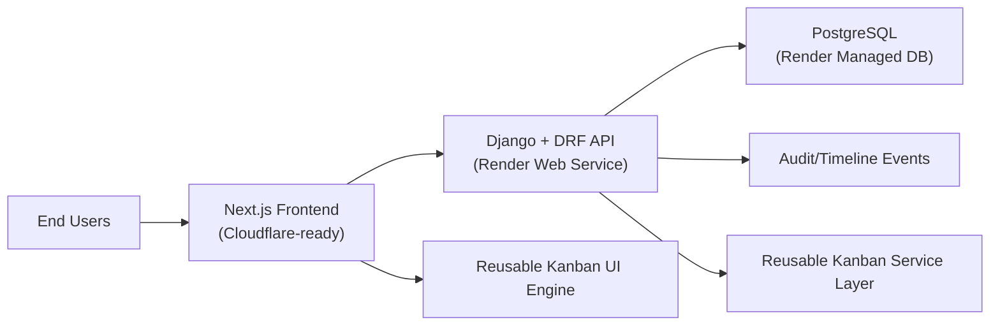

# Digital Factory Management System
## End-to-End Detailed Project Report (Client Handover)

**Project**: Digital Factory Management System (ERP + CRM)
**Prepared For**: Client Delivery & Operations Leadership
**Version**: v2.0 Handover
**Prepared On**: April 15, 2026
**Prepared By**: Product Engineering Team

---

## 1. Executive Summary

The Digital Factory Management System is a production-grade, full-stack business platform that combines factory operations, planning, quality, inventory, productivity, reporting, and a newly integrated **CRM + reusable Kanban engine** in a single ERP ecosystem.

The platform is designed for operational control and revenue workflow execution:

1. **Factory Operations**: orders, daily production, materials, quality, workforce, planning.
2. **Revenue Operations (CRM)**: leads, accounts, contacts, opportunities, activities, tasks, quotations, timeline, dashboard.
3. **Execution Layer**: premium table/list workflows + reusable Kanban workflows.
4. **Governance Layer**: role-based access, API permissions, audit-ready event trail.

This release focuses on production readiness, scale-safe architecture, and a premium SaaS-grade operator experience for both desktop and mobile web.

---

## 2. Delivery Scope

### 2.1 Delivered Modules

### Core ERP

1. Authentication & session lifecycle (JWT)
2. Users, buyers, production lines
3. Orders & order lifecycle visibility
4. Production entries & progress capture
5. Inventory (materials, inward, issues, adjustments, stock summary, variance)
6. Workforce (workers, productivity entries, productivity summary)
7. Quality (defect types, inspections, quality summaries)
8. Planning (plans, calendar, planned-vs-actual)
9. Reports hub + CSV exports

### CRM Module (New)

1. CRM dashboard
2. Leads
3. Accounts / Companies
4. Contacts
5. Opportunities / Deals
6. Activities
7. Tasks / Follow-ups
8. Notes / internal collaboration
9. Quotations + quote items
10. Timeline / audit feed
11. CRM settings (pipelines, stages, options, tags, custom fields)
12. Assignment, bulk actions, and conversion flows

### Reusable Kanban Engine (New)

1. Generic board model and configuration
2. Stage-based cards for leads, opportunities, tasks
3. Drag-and-drop stage movement with backend validation
4. Board summaries, filters, owner/priority/search support
5. Transition history + audit capture
6. Extensible architecture for future module adapters (orders/support/approvals)

### UI/UX Enhancements

1. Premium login experience
2. Dark theme as default with light mode switch
3. Sidebar/topbar premium refresh
4. Drawer-first quick interaction model for CRM entities
5. Responsive behavior improvements for desktop/tablet/mobile

---

## 3. System Architecture



### 3.1 Backend Stack

1. Django 5
2. Django REST Framework
3. django-filter
4. SimpleJWT
5. Gunicorn + WhiteNoise

### 3.2 Frontend Stack

1. Next.js 16 (App Router)
2. React 19 + TypeScript
3. Tailwind CSS
4. TanStack Query
5. React Hook Form + Zod
6. dnd-kit for Kanban drag-drop

### 3.3 Deployment Topology

1. Backend deployment via Render Blueprint (`render.yaml`, autoDeploy enabled)
2. Frontend Cloudflare/OpenNext ready (`npm run deploy` script available)
3. Git-based release flow from `main`

---

## 4. Security, Auth & Access Control

1. JWT-based authentication (`access` + `refresh`)
2. Backend permission classes enforce action-level controls
3. Role-based feature visibility in frontend navigation
4. CRM settings APIs restricted to elevated roles
5. Assignment/stage-change/audit events persisted for traceability

---

## 5. Detailed Functional Coverage

## 5.1 CRM: Lead Management

1. Lead creation/edit/list/detail
2. Lead status & priority management
3. Source tracking and value capture
4. Assignment and follow-up fields
5. Lead-to-account/contact/opportunity conversion endpoint
6. Lead Kanban and list workflows
7. Lead timeline integration (activities/notes/tasks/audit)

## 5.2 CRM: Accounts & Contacts

1. Account 360 data structure with linked contacts/deals/quotes/activities/tasks
2. Contact ownership, preferred contact mode, primary contact flag
3. Tags + custom fields support
4. Account/contact filters and searchable list endpoints

## 5.3 CRM: Opportunities

1. Deal lifecycle with pipeline + stage
2. Probability and weighted value handling
3. Win/loss markers and reasons
4. Stage movement API with validation
5. Opportunity Kanban/list and timeline integration

## 5.4 CRM: Activities, Tasks, Notes

1. Activity types: call/email/meeting/follow-up/demo/etc.
2. Task statuses and due-date execution tracking
3. Internal notes on core CRM entities
4. Reminder model for upcoming/overdue workflows

## 5.5 CRM: Quotations

1. Quote creation linked to opportunity/account/contact
2. Quote items with tax/discount/line totals
3. Quote status flow (draft/sent/viewed/accepted/rejected/expired/revised)
4. Quote-to-order integration-ready field (`converted_order`)

## 5.6 CRM: Dashboard & Analytics

1. Total leads, source split, status split, owner split
2. Opportunity stage analytics
3. Pipeline value and weighted pipeline value
4. Won/lost/open deal metrics
5. Conversion and follow-up indicators
6. Top performers aggregation

## 5.7 Reusable Kanban Engine

1. Shared backend adapter/service architecture by module key
2. Generic board fetch endpoint with columns/cards/summary/meta
3. Generic move endpoint with transition checks + audit capture
4. Frontend reusable components:
   - `KanbanBoard`
   - `KanbanColumn`
   - `KanbanCard`
   - `KanbanToolbar`
   - `KanbanSummaryBar`
   - `KanbanQuickViewDrawer`
5. Module-specific adapters for leads/opportunities/tasks

---

## 6. API Delivery Summary

Base path: `/api/v1/`

### 6.1 Core ERP APIs

1. Auth (`/auth/*`)
2. Users, buyers, lines, orders, production entries
3. Inventory, quality, planning, dashboard, reports

### 6.2 CRM APIs

1. CRUD:
   - `/crm/leads/`
   - `/crm/accounts/`
   - `/crm/contacts/`
   - `/crm/opportunities/`
   - `/crm/activities/`
   - `/crm/tasks/`
   - `/crm/notes/`
   - `/crm/quotations/`
2. Config:
   - `/crm/tags/`
   - `/crm/pipelines/`
   - `/crm/pipeline-stages/`
   - `/crm/options/`
   - `/crm/custom-fields/`
   - `/crm/kanban-config/`
3. Workflow:
   - `/crm/leads/{id}/convert/`
   - `/crm/kanban/boards/{module_key}/`
   - `/crm/kanban/move/`
   - `/crm/timeline/`
   - `/crm/dashboard/summary/`
   - `/crm/filters/metadata/`
   - `/crm/bulk-actions/`
   - `/crm/assign/`

---

## 7. Frontend Route Coverage

### ERP

1. `/dashboard`
2. `/orders`, `/orders/[id]`
3. `/production-entries`
4. `/materials`, `/material-inward`, `/material-issues`, `/stock-adjustments`
5. `/inventory/stock-summary`, `/inventory/consumption-variance`
6. `/workers`, `/worker-productivity`, `/worker-productivity/summary`
7. `/defect-types`, `/quality-inspections`, `/quality/summary`
8. `/production-plans`, `/production-plans/calendar`, `/production-plans/planned-vs-actual`
9. `/reports/*`

### CRM

1. `/crm`
2. `/crm/dashboard`
3. `/crm/leads`
4. `/crm/accounts`
5. `/crm/contacts`
6. `/crm/opportunities`
7. `/crm/activities`
8. `/crm/tasks`
9. `/crm/quotations`
10. `/crm/settings`

### Auth/Profile

1. `/login`
2. `/profile`

---

## 8. Data Model Summary (CRM)

Major CRM entities implemented:

1. `CRMLead`
2. `CRMAccount`
3. `CRMContact`
4. `CRMOpportunity`
5. `CRMActivity`
6. `CRMTask`
7. `CRMNote`
8. `CRMQuotation`
9. `CRMQuotationItem`
10. `CRMTag`
11. `CRMPipeline`
12. `CRMPipelineStage`
13. `CRMOption`
14. `CRMCustomFieldDefinition`
15. `CRMCustomFieldValue`
16. `CRMKanbanBoardConfig`
17. `CRMAuditEvent`
18. `CRMStageTransitionHistory`
19. `CRMAssignmentHistory`
20. `CRMReminder`
21. `CRMImportJob`

This structure is designed for long-term extensibility and reusable workflow orchestration.

---

## 9. QA, Validation & Stability

### 9.1 Backend

1. Django system checks passing
2. CRM API test suite passing (`apps.crm.tests.test_api`)
3. Seed command validated with CRM + ERP sample data

### 9.2 Frontend

1. Lint passing
2. Production build passing
3. Hydration mismatch mitigation applied (root layout updates)
4. Theme behavior stabilized for dark-default experience

---

## 10. Demo Data & Credentials

### 10.1 Seed Command

```bash
cd backend
./venv/bin/python manage.py seed_data --reset-crm
```

### 10.2 Seeded CRM Snapshot

1. 7 leads
2. 4 accounts
3. 5 contacts
4. 6 opportunities
5. 5 activities
6. 5 tasks
7. 3 quotations

### 10.3 Demo Logins

1. Admin: `admin / Admin@123`
2. Supervisor: `sup_amit / Supervisor@123`
3. Supervisor: `sup_neha / Supervisor@123`
4. Planner: `planner_om / Planner@123`
5. Quality: `qc_riya / Quality@123`
6. Store: `store_maya / Store@123`
7. Viewer: `viewer_raj / Viewer@123`

---

## 11. Deployment & Release Notes

### 11.1 Backend (Render)

1. `render.yaml` uses `autoDeploy: true`
2. `main` push triggers deployment
3. Startup command includes migrations and idempotent seeding guard

### 11.2 Frontend (Cloudflare-ready)

1. Build script: `npm run build`
2. Deploy script: `npm run deploy`
3. Ensure production env uses correct API base URL and CORS-matching domains

### 11.3 Mandatory Production Config Validation

1. `ALLOWED_HOSTS`
2. `CORS_ALLOWED_ORIGINS`
3. `CSRF_TRUSTED_ORIGINS`
4. `BACKEND_PUBLIC_URL`
5. Frontend `NEXT_PUBLIC_API_BASE_URL`

---

## 12. Operational Runbook (Post-Go-Live)

1. Monitor health endpoint `/api/v1/health/`
2. Monitor login success/failure rates
3. Review API logs for CORS/CSRF/auth errors
4. Validate dashboard and CRM board loads across desktop/mobile
5. Run backup and restore drill on managed database
6. Track overdue CRM activities/tasks as adoption KPI

---

## 13. Business Impact (Expected)

1. Faster lead-to-deal execution due to unified CRM + operations data
2. Better planning accuracy from integrated production and sales visibility
3. Reduced manual coordination overhead across teams
4. Improved accountability via owner assignments, stage history, and audit events
5. Better leadership decisions through dashboard + report coverage

---

## 14. Recommended Next Phase

1. WhatsApp/email activity integrations
2. Quote PDF generation and approval workflow
3. Advanced CRM analytics (funnel cohorts, stage SLA)
4. Pipeline automation rules (triggers/reminders/escalations)
5. Customer portal and order status sharing
6. Native mobile app (if required)

---

## 15. Handover Checklist

1. Source code delivered and pushed to `main`
2. Deployment pipeline connected
3. Environment variables documented
4. Seed and test commands documented
5. Client user credentials shared securely
6. Release notes and feature map completed
7. Support and next-phase roadmap outlined

---

## Appendix A: Important Commands

```bash
# Backend
cd backend
./venv/bin/python manage.py migrate
./venv/bin/python manage.py seed_data --reset-crm
./venv/bin/python manage.py test apps.crm.tests.test_api

# Frontend
cd frontend
npm install
npm run lint
npm run build
# (Cloudflare target)
npm run deploy
```

---

## Appendix B: Project Positioning Statement

Digital Factory Management System is now positioned as a **factory operations + revenue operations business OS**, where manufacturing execution and sales pipeline execution are connected through one scalable, premium, modular platform.
